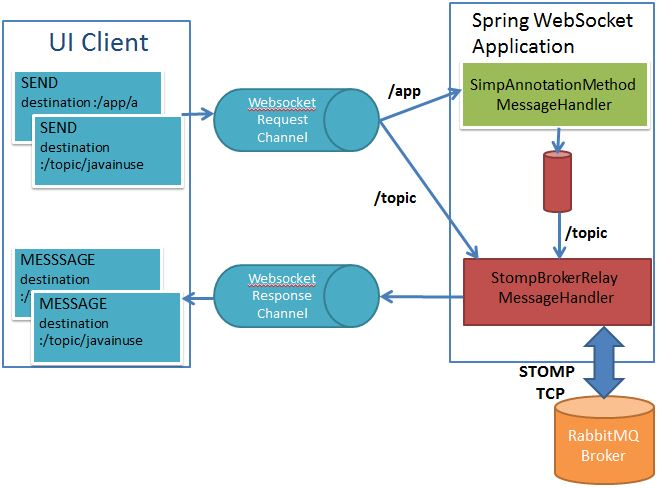
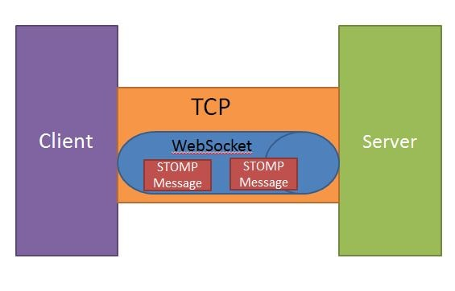
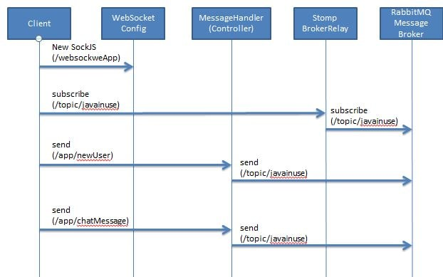

#### springboot-websocket-chat-architecture

For this Project we will be making use of STOMP protocol. STOMP is a simple text-oriented messaging protocol used by our UI Client(browser) to connect to enterprise message brokers.
Clients can use the SEND or SUBSCRIBE commands to send or subscribe for messages along with a "destination" header that describes what the message is about and who should receive it.
It defines a protocol for clients and servers to communicate with messaging semantics. It does not define any implementation details, but rather addresses an easy-to-implement wire protocol for messaging integrations. The protocol is broadly similar to HTTP, and works over TCP using the following commands:
- CONNECT
- SEND
- SUBSCRIBE
- UNSUBSCRIBE
- BEGIN
- COMMIT
- ABORT
- ACK
- NACK
- DISCONNECT

#### springboot-websocket-stomp-architecture

## Backend

When using Spring's STOMP support, the Spring WebSocket application acts as the STOMP broker to clients. Messages are routed to @Controller message-handling methods or to a simple, in-memory broker that keeps track of subscriptions and broadcasts messages to subscribed users.
You can also configure Spring to work with a dedicated STOMP broker (e.g. RabbitMQ, ActiveMQ, etc) for the actual broadcasting of messages. In that case Spring maintains TCP connections to the broker, relays messages to it, and also passes messages from it down to connected WebSocket clients.

1. Define the domain class WebSocketChatMessage as follows- WebSocketChatMessage.java

2. Define the WebSocket Configuration class - WebSocketChatConfig.java

- @Configuration tells that it is a Spring configuration class. @EnableWebSocketMessageBroker enables WebSocket message handling, backed by a message broker. Here we are using STOMP as a mesage broker. The method configureMessageBroker() enables a rabbitmq message broker to carry the messages back to the client on destinations prefixed with "/topic" and "/queue".
- Also here we have configured that all messages with "/app" prefix will be routed to @MessageMapping-annotated methods in controller class.
For example "/app/chat.sendMessage" is the endpoint that the WebSocketController.sendMessage() method is mapped to handle.

3. Define the WebSocker Listener class - WebSocketChatEventListener.java

- This class listens to events such as a new user joining the chat or an user leaving the chat.

4. Define the controller class - WebSocketChatController.java

- Previously we have configured the websocket such that all messages coming from the client with prefix "/app" will be routed to the appropriate message handling methods annotated with @MessageMapping.
- For example, a message with destination /app/chat.newUser will be routed to the newUser() method, and a message with destination /app/chat.sendMessage will be routed to the sendMessage() method.

## Frontend
1. Define the index.html. Here we have defined the UI for our chat application. Also it makes use of the sockjs and stomp libraries. The HTML file contains the user interface for displaying the chat messages. It includes sockjs and stomp javascript libraries. SockJS is a browser JavaScript library that provides a WebSocket-like object. SockJS gives you a coherent, cross-browser, Javascript API which creates a low latency, full duplex, cross-domain communication channel between the browser and the web server.
STOMP JS is the stomp client for javascript.
2. Define the javascript file. The stompClient.subscribe() function takes a callback method which is called whenever a message arrives on the subscribed topic. The connect() function makes use of the SockJS and stomp client to establish connection to the to the /websocketApp endpoint that we configured in Spring Boot application. The client subscribes to /topic/javainuse destination.
3. Define the CSS

